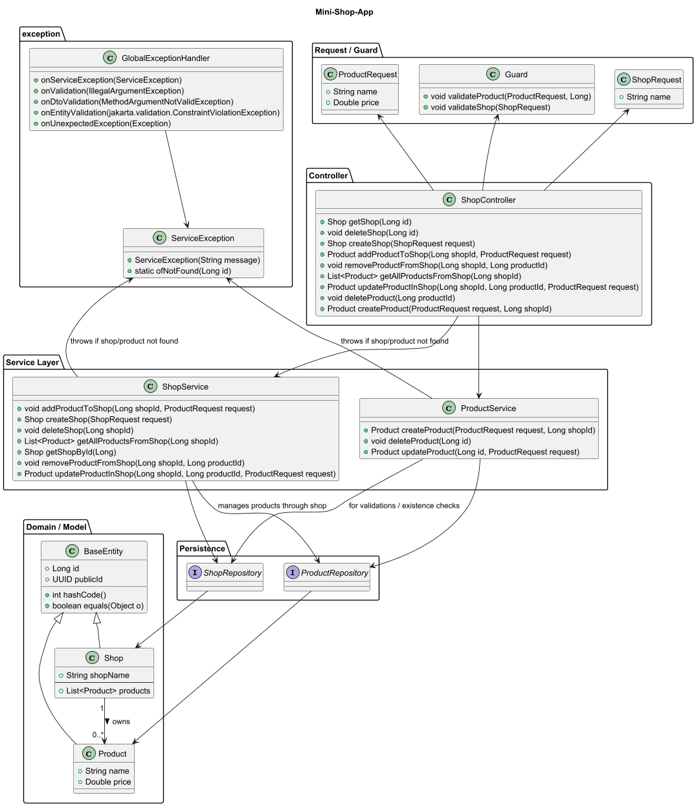

Wir sollen uns eine App überlegen, mit zwei Domain-Models. 
Es soll zwei Entities geben welche in der Beziehung "One to any" stehen.
Spring Data muss verstehen das es da ein @OneToMany gibt

Es braucht 1 Controller, 1 Service, die 2 Domain-Klassen (Model/Domain) / deren 2 Repositories (Persistence).
(Nice to have): 1 Guard (für Validation), 1 Request-Klasse (View-Model) (für First Line of Defence), 

Später wird gemeinsam der Controller-Test durchgeführt mit der H2-Datenbank.
Dies ist also nicht zu tun.

## Tests

file:///C:/Users/dvora/Desktop/Mini/build/reports/tests/test/index.html

### Repository / DB-Integration Tests
- [x] Shop speichern und abrufen
- [x] Shop löschen
- [x] Shop nach Name suchen
- [x] Product speichern und abrufen
- [x] Product löschen
- [x] `existsByName` prüfen
- [x] `findByName` prüfen
- [x] 1:n Beziehung Shop → Products prüfen
- [x] Orphan Removal prüfen
- [x] Doppelte Produkte verhindern
- [x] Cascade Delete prüfen

### Service Layer Tests
- [ ] ShopService: `createShop`
- [ ] ShopService: `getShopById` (existierend / nicht existierend)
- [ ] ShopService: `deleteShop`
- [ ] ShopService: `addProductToShop`
- [ ] ShopService: `removeProductFromShop`
- [ ] ShopService: `getAllProductsFromShop`
- [ ] ShopService: `updateProductInShop`
- [ ] ProductService: `createProduct`
- [ ] ProductService: `deleteProduct`
- [ ] ProductService: `updateProduct`
- [ ] Prüfen, dass ServiceException korrekt geworfen wird

### API / Controller Tests
- [ ] GET `/api/shop/{id}` → 200 / 404
- [ ] POST `/api/shop` → 201
- [ ] DELETE `/api/shop/{id}` → 204 / 404
- [ ] POST `/api/shop/{shopId}/products` → 201
- [ ] DELETE `/api/shop/{shopId}/products/{productId}` → 204
- [ ] GET `/api/shop/{shopId}/products` → 200
- [ ] PUT `/api/shop/{shopId}/products/{productId}` → 200
- [ ] Prüfen, dass ungültige Requests 400 zurückgeben
  

